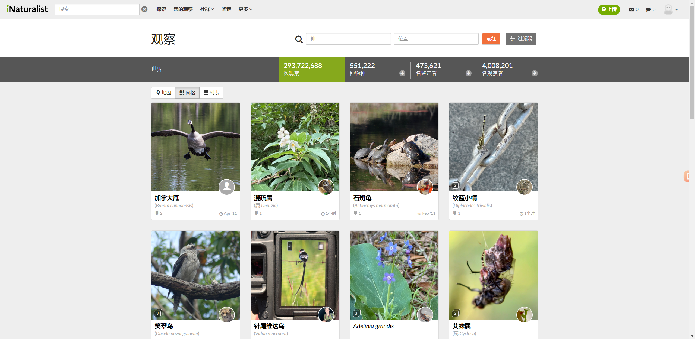
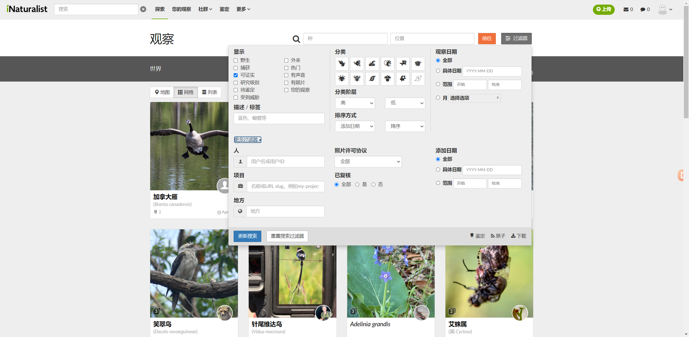
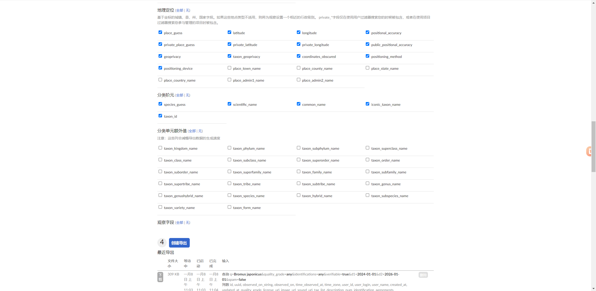
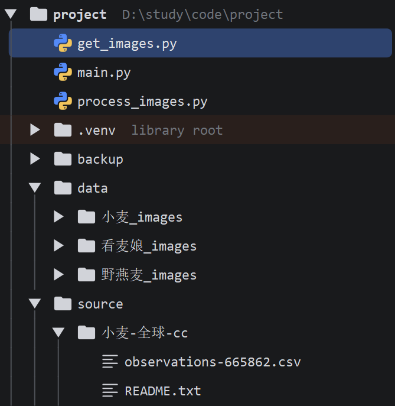

# 小麦杂草图像识别 -- 二分类

## 项目简介
本项目主要的作用是识别小麦与杂草，是一个二分类问题。后续可能扩展为多分类。

初始训练数据使用 2000 张小麦图片 + 2000 张杂草图片(野燕麦 1000 张 + 看麦娘 1000 张)进行训练，训练数据
是从 `inaturalist` 上下载的，下载教程参考 `数据集下载` 章节。

## 项目背景
前段时间，我的一位大学同学叫我帮助她实现一个图像识别程序，作用是识别小麦和杂草。

第一次做这个项目，没有什么经验，于是最开始先是找到了一些数据集以备后用，后续工作因为时间关系并没有做，最近心血来潮，将这个项目完成，算是锻炼自己了。  

我是在 `inaturalist` 上下载的数据集，下面贴上下载网址，关于如何下载，请查看 `数据集下载` 章节:
> https://www.inaturalist.org/observations

## 项目结构
项目主要使用 `pytorch`、`numpy`、`pandas`、`matplotlib`、`opencv`、`pillow`、`sk-learn`、`flask` 这些第三方库实现

项目结构:
```text
./ImageRecognition/
    - main.py
    - app.py
    - assets/
    - data/raw/
        - wheat ················· 小麦
        - weed_alopecurus ······· 看麦娘
        - weed_avena ············ 野燕麦
    - ...
```

## 数据集下载
关于如何下载，可以去网络上搜索一些教程，在此简单描述下载过程:

首先打开网站并且注册登录账号，登录完毕后可以看到如下界面:


点击过滤器，输入想下载的标签或者描述，然后点击更多过滤器，可以根据时间、许可协议等过滤内容


过滤完内容后点击弹出页右下角的下载按钮，此时会新打开一个页面，确认过滤内容没有问题之后，点击创建导出，等待一段时间之后即可下载返回的数据了。


最后等待返回数据点击下载即可，也可以根据页面提示，让服务器将数据文件返回到自己的邮箱，此处不再赘述。

### 上述步骤只能得到所有图片的网址，要想得到图片，可以使用Python爬虫下载图片

此处贴上我的爬虫代码文件 `get_images.py` 的内容:
```python
#!/usr/bin/env python3
# -*- coding: utf-8 -*-

import os
import time
import random

import requests
import pandas as pd
from tqdm import tqdm

headers = {
    'user-agent': 'Mozilla/5.0 (Windows NT 10.0; Win64; x64) AppleWebKit/537.36 (KHTML, like Gecko) Chrome/143.0.0.0 Safari/537.36',
}
bird_file_map = {}

for dirname in os.listdir('./source'):
    bird_name = dirname.split('-')[0]

    # 获取 csv 所在的文件目录
    csv_path = f'./source/{dirname}'  # csv_path = './source/乌鸦-中国-cc0'
    inner_lst = os.listdir(csv_path)
    for file in inner_lst:
        if file.endswith('.csv'):
            csv_full_path = f'./source/{dirname}/{file}'
            bird_file_map[bird_name] = csv_full_path
            break

for bird_name, file_path in bird_file_map.items():
    df = pd.read_csv(file_path)
    image_url_list = list(df['image_url'])
    if len(image_url_list) > 2000:
        image_url_list = image_url_list[0:2000]
    if not os.path.exists(f'./data/{bird_name}_images'):
        os.makedirs(f'./data/{bird_name}_images')
    for url in tqdm(image_url_list, f'正在下载{bird_name}'):
        if isinstance(url, str):
            file_name = url.split('/')[-2]
            file_suffix = url.split('.')[-1]
            try:
                response = requests.get(url, headers=headers, stream=True)
                if response.status_code == 200:
                    with open(f'./data/{bird_name}_images/{file_name}.{file_suffix}', 'wb') as fp:
                        fp.write(response.content)
                        time.sleep(random.uniform(2, 5))
            except Exception as e:
                print(f'下载/保存 {bird_name} 图片 {file_name} 的过程中出现错误：{e}')
```

使用上述代码需要注意：
- 下载所需的第三方库 `requests pandas tqdm openpyxl`
- 将下载的数据集存储到 `./source/` 这个位置
- 下载完成的数据会存储到 `./data/` 这个位置

如下图示例:



